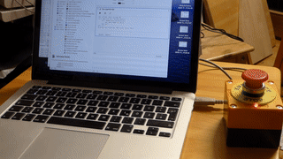
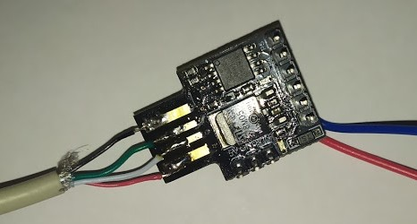
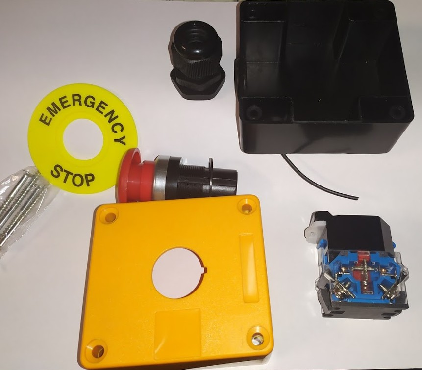
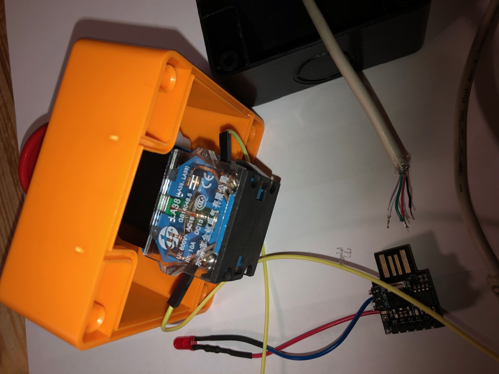
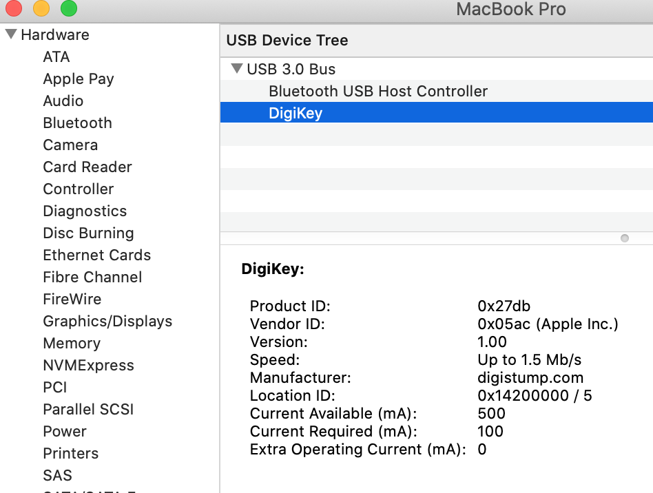
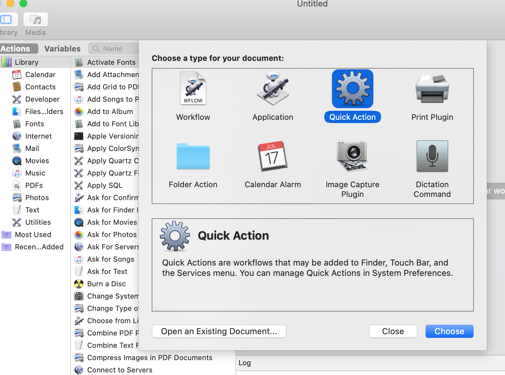
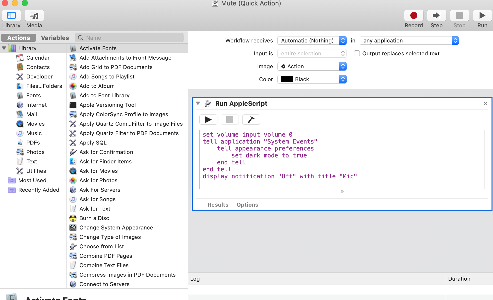
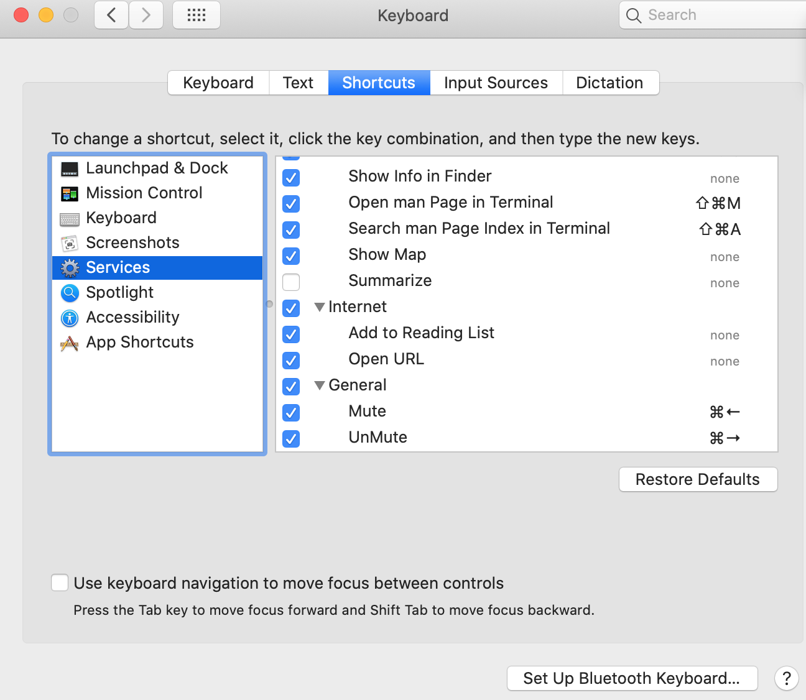
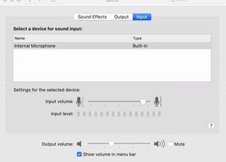

# mute-macbook-microphone-in-style
Arduino sketch / AppleScripts to mute a Mac microphone via hardware emergency button on USB

## Problem
As a remote worker you are probably in daily conference calls. Often it is not obvious if your microphone is muted or accidently open - getting you the dreaded **you are on mute** or **please mute your microphone** from your colleagues. A quick way to see the state of your microphone and a quick way to mute/unmute would be nice.

## Overview
On a Mac you can execute AppleScript through keystrokes which mute/unmutes your microphone system wide. So you do not have to distinguish between the different chat/conference applications. It is even better to build a separate USB device acting as keyboard which is used only for this purpose.
A hardware **emergency stop** button is perfect to solve the problem - just smack it down and you are muted! You can even add an indicator LED to display the current state.



## Hardware: Digispark

For checking a single switch, driving an LED and emulating an USB keyboard an Arduino seems an obvious choice.
Of the smaller Arduinos not many have an USB interface, but there is the **Digispark** Board from Digistump which fits the bill and is also very small. There are many clones of this board available at the usual sources. I got one via Ebay, but the mechanical dimensions where a bit off, so it did not make contact in my MacBooks USB socket. I cannibalized an USB cable and soldered it to the boards contacts - problem solved. You can also use an *Adafuit trinket* (or clone) which is very similar to the Digisspark and has an USB connector for plugging in a cable. The clones go for about $2.



### Software USB
The board uses the ATtiny85 processor which has no hardware USB. Instead Digispark runs the *micronucleus tiny85* bootloader which is based on the V-USB software USB stack. It uses software bit-banging to drive USB. V-USB is a very impressive piece of software from *objective development* which they open sourced.

#### Prepare Arduino IDE

##### Install the Digistump Arduino extension
Assuming you already have set up a local Arduino IDE, follow the instructions at https://digistump.com/wiki/digispark/tutorials/connecting to install the Digistump extension. The Digistump Arduino IDE extension contains all tools to compile and upload the Software to the Digispark board.

##### Add special keycodes
The extension already contains a keyboard emulation, but for the Macs CMD-ARROW-LEFT (mute) and CMD-ARROW-RIGHT (unmute)  - which i am using - the keycodes are missing.
To add these, edit DigiKeyboard.h and add the missing codes (CMD modifier and missing arrow codes), on my Arduino installation (on a Ubuntu Linux system) i found the file here:
`.arduino15/packages/digistump/hardware/avr/1.6.7/libraries/DigisparkKeyboard/DigiKeyboard.h`

Add keycodes:

```
#define MOD_CMD_LEFT 0x00000008

#define KEY_ARROW_RIGHT 0x4F
#define KEY_ARROW_LEFT 0x50
#define KEY_ARROW_UP 0x52
#define KEY_ARROW_DOWN 0x51
```
##### We want an Apple keyboard, do we?
If the emulated keyboard is plugged in to a Mac, a *new keyboard detected* message will pop up. To avoid this, the device can be spoofed as genuine Apple product and no popup will occur :-). 

This time you have to edit `.arduino15/packages/digistump/hardware/avr/1.6.7/libraries/DigisparkKeyboard/usbconfig.h` and change the vendor ID:

```
#define USB_CFG_VENDOR_ID 0xac, 0x05
```


## Prepare **Emergency stop** button
There are cheap emergency stop buttons available at eBay. The buttons come in parts which you have to assemble:



Be aware that there are different pinouts of the Digispark board. On mine i connected Pin 0 to one switch contact, the other switch contact to GND. No pullup resistor is needed, there is an internal one available on the ATtiny85. I used Pin 1 to drive the LED via an 220 Ohm resistor and drilled a hole for it into the casing. For reliabilty all connections where soldered, but you may get away with the usual DuPont connector cables.
Now with some fiddling the Digispark board can be put inside the emergency switch casing. The USB cable is routed to the rubber protecting the hole. You have a shiny new *Emergency USB-Button*



## Arduino sketch
For the switch an Arduino sketch is needed to check the switch state and sending keystrokes to the Mac. Also the LED (on Pin 1) will be switched on/off according to the state.

`https://blog.thestaticturtle.fr/auto-muting-myself-during-class/` was used as inspiration, this very small sketch is the result:
```
#include "DigiKeyboard.h"

#define ledPin 1
#define inputPin 0

void setup() {
    pinMode(inputPin,INPUT_PULLUP);
    pinMode(ledPin, OUTPUT);
}

void loop() {
  DigiKeyboard.delay(5);
  // switch LED ON
  digitalWrite(ledPin, HIGH); 
  if(!digitalRead(inputPin)) {
    // send Mute key if switch closed
    DigiKeyboard.sendKeyStroke(0);
    DigiKeyboard.sendKeyStroke(KEY_ARROW_LEFT, MOD_CMD_LEFT); 
    // switch LED OFF
    digitalWrite(ledPin, LOW); 
    // wait for switch to open
    while(!digitalRead(inputPin)) { 
      DigiKeyboard.delay(100); 
      }
    // send unmute Key
    DigiKeyboard.sendKeyStroke(KEY_ARROW_RIGHT, MOD_CMD_LEFT);
  }
}

```
### Program, connect and verify
After compiling and uploading  the sketch onto the Digispark board, connect it to the Mac.

Now you should see the USB device if you open *About This Mac* and generate a System report. On Hardware/USB there is a device *DigiKey* with the spoofed Vendor *Apple Inc*.




## Mac
### AppleScript to mute/unmute the microphone
On the Mac side the keystrokes need to be processed. This is done by two AppleScript to mute/unmute the microphone.

Create the scripts with the *Automator app* (included in MacOS). Open Automator and create a *Quick Action*



In the dialog select *Run AppleScript* and paste the Mute.scpt script into the window.

```
set volume input volume 0
tell application "System Events"
    tell appearance preferences
        set dark mode to true
    end tell
end tell
display notification "Off" with title "Mic"
```

This script first mutes the microphone and then switches to *dark mode* as additional mute indicator.
Your Quick Action should look like this:



Save it and name it *Mute*

Create another action named *UnMute* which does the opposite by pasting `UnMute.scpt` from the AppleScript folder.

You can check if the actions work by executing them manually.

### Bind the scripts to keyboard shortcuts
The last step is to bind the scripts to keyboard shortcuts, to CMD-ARROW-LEFT and CMD-ARROW-RIGHT.
This is done in the *Keyboard* section of your *System Preferences*:

Open System Preferences, go to Keyboard and select *Shortcuts*. Select *Services* on the left and you will find *Mute* and *UnMute* in the *General* section at the end of the list. These are the AppleScript actions which you just created.

Select each of the Services and *add Shortcut* using CMD-ARROW-LEFT for Mute. Tick the checkbox and do the same with *UnMute* using CMD-ARROW-RIGHT.




You will get some alerts after pressing the button the first time - you have to *allow* the shortcuts and you are done.

Opening your *Sound* system preferences you will see the *input volume* setting changes when you press/release the emergency button:



## Other things
Of course you can change the keycodes in the Arduino sketch or use other AppleScripts to do other things with your *emergency button*.

Enjoy!

## Links
* Digistump http://digistump.com/products/1
* V-USB https://www.obdev.at/products/vusb/index.html
* Digispark vs Adafruit trinket https://hackaday.com/2014/01/22/body-of-a-trinket-soul-of-a-digispark/
* https://digistump.com/wiki/digispark/tutorials/connecting
* Spoof Apple keyboard https://github.com/chris408/digispark-usbkey-board/blob/master/README.md#apple-keyboard-spoof
* Inspiration https://blog.thestaticturtle.fr/auto-muting-myself-during-class/
* ATtiny85 micronucleus https://github.com/micronucleus/micronucleus

